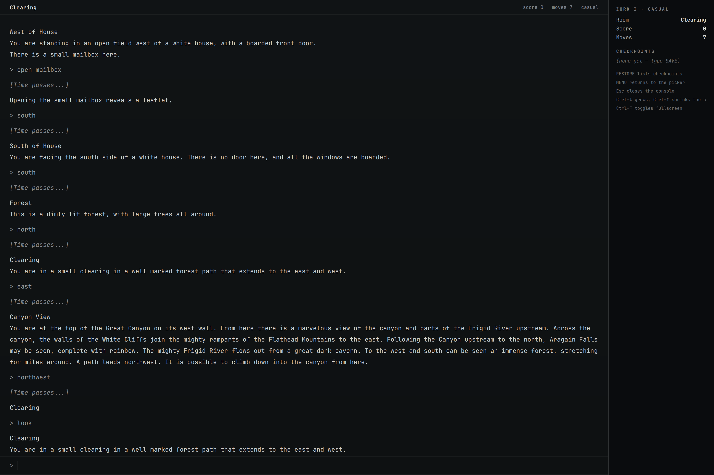

# omazork

Zork I, II, and III as an [Omarchy](https://omarchy.org) shell plugin: a
phosphor console that slides down over whatever you're doing, running the
authentic Infocom story files through an embedded Z-machine. No external
dependencies — one static Go binary the plugin bootstraps itself.



Two ways to play, chosen per playthrough:

- **Classic** — the games exactly as shipped in the 1980s.
- **Casual** — a mediation layer paces play: every action takes the time it
  plausibly would — a minute or two to cross a room, longer to inflate a
  boat, hours for the rare dramatic moment — and its outcome is withheld
  until that time has passed. Short waits pass quietly ("Time passes.");
  from five minutes up, close the console, live your life, and come back to
  a "While you were away…" recap and one desktop notification. Looking,
  combat, failed turns, and deaths never wait.

Autosave every turn (a shell restart resumes invisibly), checkpoints via
in-game SAVE/RESTORE, per-playthrough stats, and lifetime achievements.

## Install

Requires a current Quickshell-based Omarchy ("quattro").

```sh
omarchy plugin add https://github.com/lucasbertoni/omazork.git --enable
```

**Keybinding** — `Super+Z` toggles the console. The plugin registers the
binding itself in the running Hyprland when it starts and again after every
config reload, and drops it when the plugin is disabled; it shows up in
`omarchy menu keybindings` like any other. If `Super+Z` is already bound in
your own `bindings.lua`, yours wins and omazork leaves it alone. To pick a
different key, or `false` for none, set it on the plugin's shell.json entry
(see **Theme** below for where that entry lives):

```sh
omarchy bar set omazork keybind '"SUPER + SHIFT + Z"'
```

**Menu entry** — the shell has no equivalent hook for menus, so add it by
hand — in `~/.config/omarchy/extensions/omarchy-menu.jsonc`:

```jsonc
"zork": { "icon": "󰊠", "label": "Zork", "action": "omarchy-shell shell toggle omazork", "aliases": ["zork"] }
```

**Bar icon** — a brass lantern in the shell bar: lit while the engine runs,
dark when it isn't, with a hollow dot while a Casual wait unfolds and a filled
dot once the recap is waiting. Click toggles
the console; hover shows game and mode (never spoilers). Fresh enables place
it automatically; if omazork was already enabled before the icon existed,
re-enable it with a placement (progress is autosaved; note this rewrites the
plugin's shell.json entry, so re-apply any `"theme"` setting after):

```sh
omarchy plugin disable omazork && omarchy plugin enable omazork --after omarchy.clock
```

**Theme** — the console follows the active omarchy theme, including light
themes and live theme switches. To keep the original green-on-black phosphor
look instead, set it on the plugin's entry in `~/.config/omarchy/shell.json`:

```jsonc
"plugins": [{ "id": "omazork", "theme": "phosphor" }]
```

With the bar icon placed, the entry lives in `bar.layout` instead of
`plugins`; set it there with `omarchy bar set omazork theme '"phosphor"'`.

**Height** — the console opens at 35% of the screen. `Ctrl+↓` grows it and
`Ctrl+↑` shrinks it, in steps of 5% between 20% and 100%; `Ctrl+F` toggles
fullscreen and returns to the height it left (or to 35% after a restart at
fullscreen). The choice persists as
`"height"` on the plugin's shell.json entry, written with `omarchy bar set`,
which only knows entries in `bar.layout` — with no bar icon placed the height
lasts for the session only. A hand-edited value applies live; out-of-range
values clamp, non-numbers fall back to 25.

## Dependencies

Nothing to install by hand. Everything the plugin runs is either in this
repository or fetched from its own GitHub Releases:

- **Engine binary** — on first launch the overlay bootstraps `bin/omazork`,
  a static Go binary containing the Z-machine, from this repository's GitHub
  Release for your architecture (x86_64/aarch64). The release tag and the
  SHA-256 of each binary are pinned in `scripts/engine.version`; the download
  is verified against that checksum before it is made executable, and a
  mismatch is discarded. CI builds the binaries reproducibly from the tagged
  commit and checks the same checksums.
- **Go toolchain (optional)** — if the download fails (offline, or no
  release yet) and `go` is on your PATH, the bootstrap builds the engine from
  this checkout instead. Nothing is fetched from any other repository.
- **`hyprctl`** — from Hyprland, already present on Omarchy, used to register
  and drop the `Super+Z` keybinding at runtime.
- **Game data** — the three `.z3` story files are bundled in `assets/games/`
  (see Licensing below).

No sudo or pkexec is required. The plugin writes only inside its own folder
(`bin/`), its own state directory (see Uninstall), and its own entry in
`~/.config/omarchy/shell.json` — via `omarchy bar set`, when you resize the
console with `Ctrl+↑`/`Ctrl+↓` or set a key yourself. It never edits your
Hyprland config: the keybinding lives in the running compositor only, and an
existing user binding on the same key is left alone.

Updates arrive through `omarchy plugin update omazork`; the bootstrap notices
the new pinned checksum on the next launch and refetches.

## Uninstall

```sh
omarchy plugin remove omazork
```

This disables the plugin (which drops the runtime `Super+Z` binding) and
deletes the plugin folder, including the downloaded engine binary. Two things
remain and are yours to delete:

- **Saves, stats, and achievements** in `~/.local/state/omazork/`
  (`$XDG_STATE_HOME/omazork` if set): `rm -rf ~/.local/state/omazork`.
- **The menu entry**, if you added one, in
  `~/.config/omarchy/extensions/omarchy-menu.jsonc`.

## Development

```sh
omarchy plugin validate .   # validate the working copy (it rejects symlinked paths)
ln -s "$PWD" ~/.config/omarchy/plugins/omazork
omarchy plugin enable omazork
touch bin/DEV   # bootstrap always go-builds, never clobbers with the release binary
```

Then, after a change, `scripts/dev.sh` runs the checks, rebuilds, restarts the
shell, opens the console, and tails the wrapper log (`--quick` skips tests and
data validation; `--no-open`, `--no-log` as named).

`go test ./...` covers the engine wrapper, mediation, saves, achievements, and
the NDJSON protocol (`docs/protocol.md`). Cut a release with
`scripts/release.sh vX.Y.Z` and push the tag; CI rebuilds with the same
flags, verifies the pinned checksums in `scripts/engine.version`, and attaches
the binaries to the GitHub Release.

## Licensing and trademarks

The plugin code is MIT (see [LICENSE](LICENSE)). The bundled `.z3` story
files are the authentic Infocom binaries released under the MIT License by
Microsoft in the `historicalsource` repositories — provenance, checksums, and
license text in [assets/games/LICENSE-zork.md](assets/games/LICENSE-zork.md).

**Zork and Infocom trademarks are not licensed.** The MIT release covers the
source code and story files only. This project is not affiliated with or
endorsed by Microsoft, Activision, or Infocom, and uses the game names solely
to identify the games.
